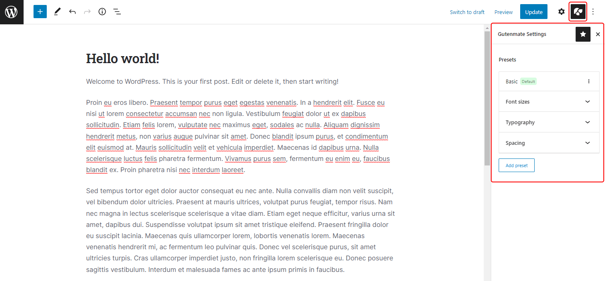

# Global Presets

The global presets is a set of typography and spcaing which predefined for using in posts or pages. The global preset panel can be located in the page editor or post editor.

There is a `Basic` profile created for quick started.

* You can add a typography settings, font sizes or spacing for using in block attributes
* To create your own profile, Click the button **Add preset**.
* To set profile as a default, Click the tree-dots button in the profile and click **Set as global default**.
* To active profile only this post/page, Click the tree-dots button in the profile and click **Activate for this post**.
* To duplicate profile, Click the tree-dots button in the profile and click **Duplicate**

After made a change, Click **Update** button of the post to save post with modified global presets.