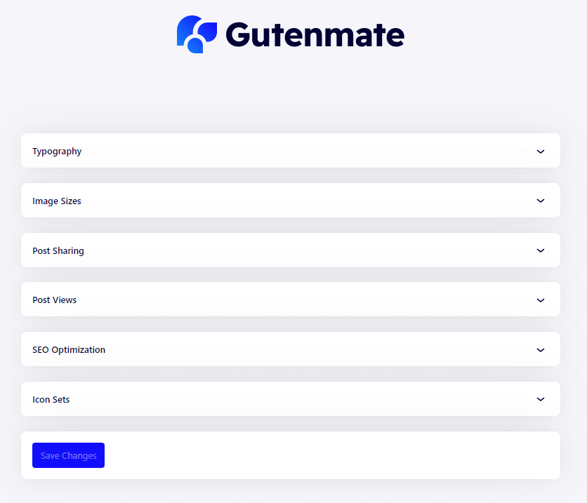

# Plugin Settings

The Gutenmate plugin has a dedicated setting page to allow user choose the way of gutenmate plugin works. The setting page can be accessed from admin menu `Admin > Gutenmate`. You will see the page as the following.

Gutenmate allow you configure these options

* **Typography** Configure a default font stacks while webfont is loading. If the theme is supports Gutenmate, You can override the typography settings (family and weight) from this section.
* **Image Sizes** Configure an image sizes for using in your website. After made a change, Please regenerate by using [this plugin](https://wordpress.org/plugins/regenerate-thumbnails/)
* **Post Sharing** Configure a site-wide options for Post Share block.
* **Post Views** Configure a site-wide options for Post Views block. The post view feature requires [this plugin](https://wordpress.org/plugins/wordpress-popular-posts/) to be working.
* **SEO Optimization** Configure an essential SEO optimization. If you're using an advanced SEO plugin, Please disable all options in this sections.
* **Icon Sets** Configure an icon set to be used. Turn on an icon pack to get more icons!

Click the button **Save Changes** after made a change.